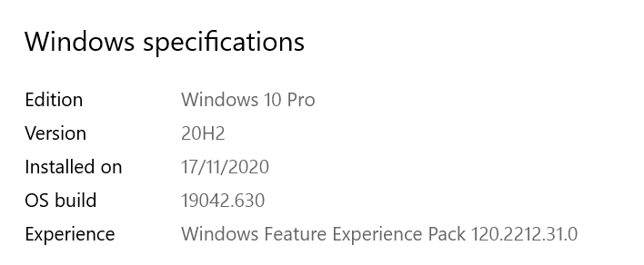

En la version de windows 10 de la siguiente imagen: 



Es necesario indicarle mediante PowerShell en modo de administrador que habilite el siguiente permiso
```
Set-ExecutionPolicy -ExecutionPolicy RemoteSigned
```
De lo contrario no sera posible usar ng serve para ver nuestros avances en el aplicativo y se observara un error como el siguiente

```
ng : File C:\Users\nayos\AppData\Roaming\npm\ng.ps1 cannot be loaded because running scripts is disabled on this system. For 
more information, see about_Execution_Policies at https:/go.microsoft.com/fwlink/?LinkID=135170.
At line:1 char:1
+ ng serve --open
+ ~~
    + CategoryInfo          : SecurityError: (:) [], PSSecurityException
    + FullyQualifiedErrorId : UnauthorizedAccess
```